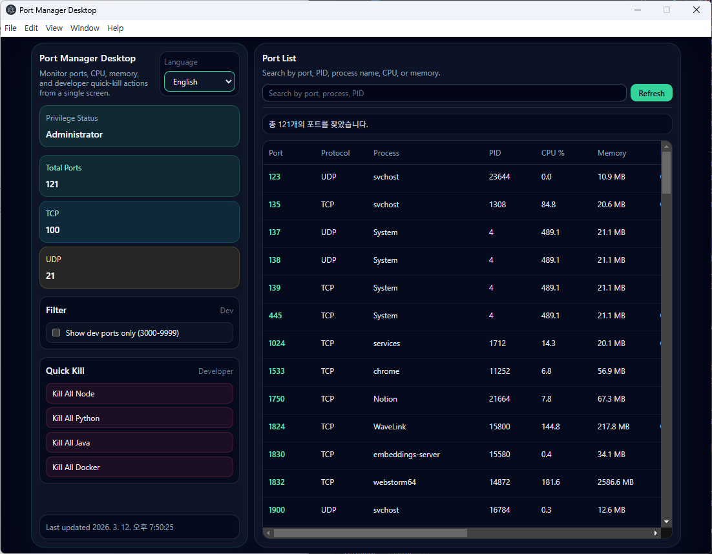
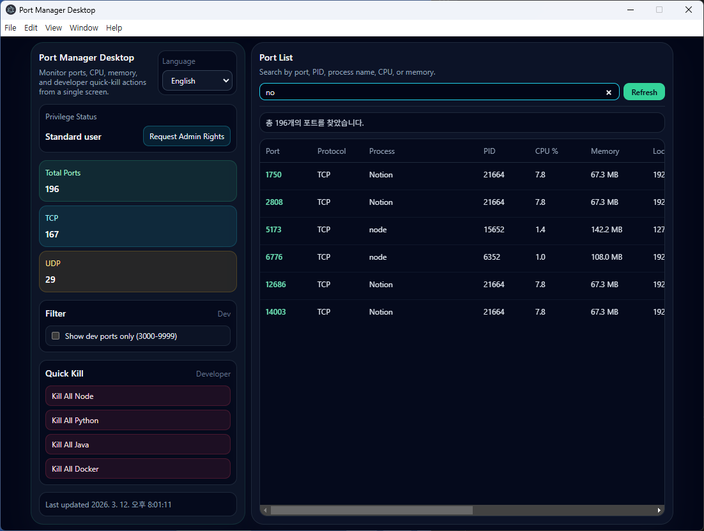
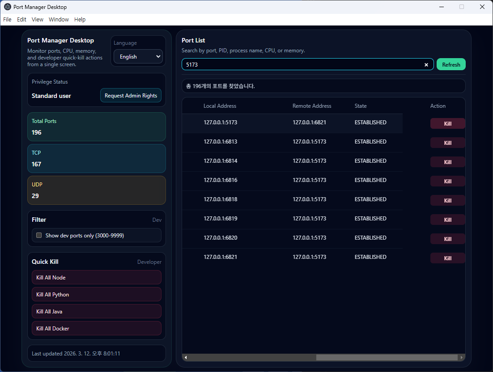
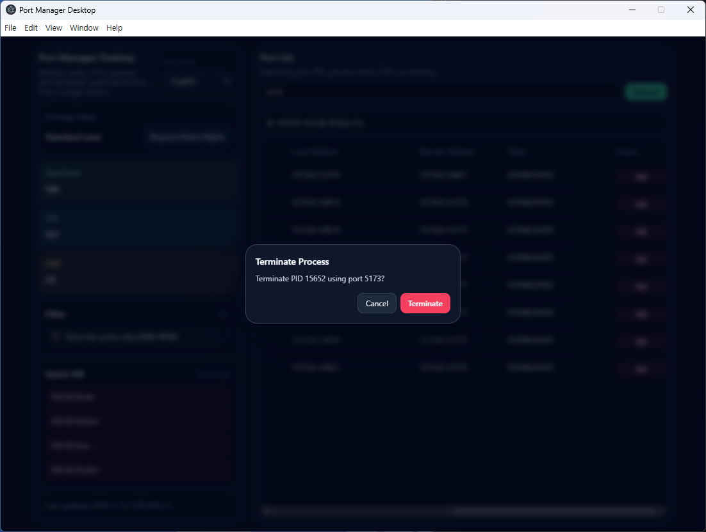

# Port Manager Desktop

Electron + React + Vite + Tailwind 기반의 크로스플랫폼 포트 관리 앱입니다.

## 기능 및 설명

- macOS / Windows 포트 점유 목록 조회
- PID 기준 프로세스 종료
- 현재 관리자 권한 여부 표시
- 관리자 권한이 없을 때 권한 상승 요청 버튼 제공
- 1024 x 768 창 기준의 고정 레이아웃 적용
- 기본 폰트 12px, 제목 14px 적용

## 실행

```bash
npm install
npm run dev
```

패키징된 렌더러만 실행하려면 아래 명령을 사용합니다.

```bash
npm run build:renderer
npm start
```

## 빌드

```bash
npm run build
```

## Preview







